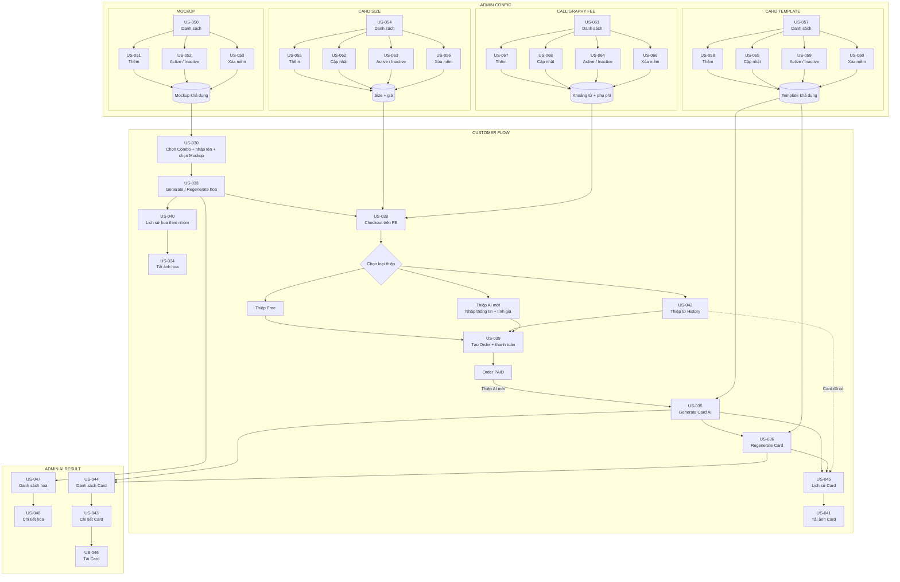
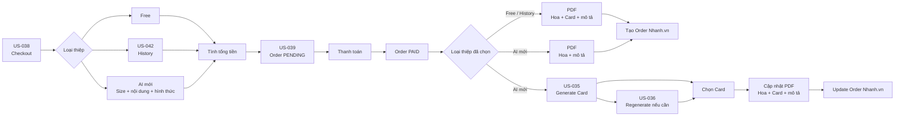
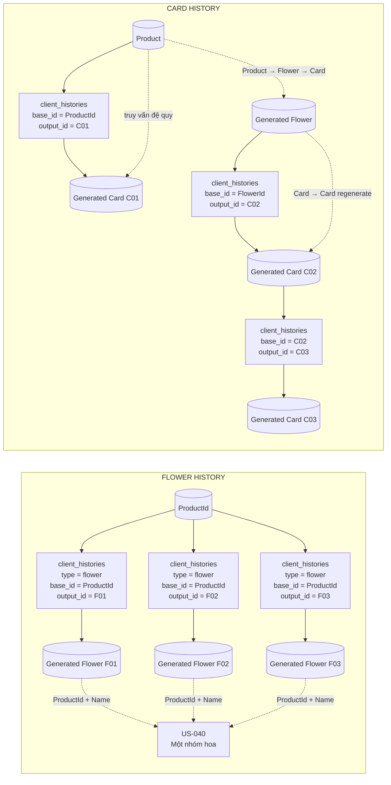

```mermaid
flowchart TB
    subgraph CONFIG[ADMIN CONFIG]
        direction LR

        subgraph MOCKUP[MOCKUP]
            direction TB
            M50[US-050<br/>Danh sách] --> M51[US-051<br/>Thêm]
            M50 --> M52[US-052<br/>Active / Inactive]
            M50 --> M53[US-053<br/>Xóa mềm]
            M51 --> MDB[(Mockup khả dụng)]
            M52 --> MDB
            M53 --> MDB
        end

        subgraph SIZE[CARD SIZE]
            direction TB
            S54[US-054<br/>Danh sách] --> S55[US-055<br/>Thêm]
            S54 --> S62[US-062<br/>Cập nhật]
            S54 --> S63[US-063<br/>Active / Inactive]
            S54 --> S56[US-056<br/>Xóa mềm]
            S55 --> SDB[(Size + giá)]
            S62 --> SDB
            S63 --> SDB
            S56 --> SDB
        end

        subgraph TEMPLATE[CARD TEMPLATE]
            direction TB
            T57[US-057<br/>Danh sách] --> T58[US-058<br/>Thêm]
            T57 --> T65[US-065<br/>Cập nhật]
            T57 --> T59[US-059<br/>Active / Inactive]
            T57 --> T60[US-060<br/>Xóa mềm]
            T58 --> TDB[(Template khả dụng)]
            T65 --> TDB
            T59 --> TDB
            T60 --> TDB
        end

        subgraph FEE[CALLIGRAPHY FEE]
            direction TB
            F61[US-061<br/>Danh sách] --> F67[US-067<br/>Thêm]
            F61 --> F68[US-068<br/>Cập nhật]
            F61 --> F64[US-064<br/>Active / Inactive]
            F61 --> F66[US-066<br/>Xóa mềm]
            F67 --> FDB[(Khoảng từ + phụ phí)]
            F68 --> FDB
            F64 --> FDB
            F66 --> FDB
        end
    end

    subgraph FLOW[CUSTOMER FLOW]
        direction TB

        C30[US-030<br/>Chọn Combo + nhập tên + chọn Mockup]
        C33[US-033<br/>Generate / Regenerate hoa]
        C40[US-040<br/>Lịch sử hoa theo nhóm]
        C34[US-034<br/>Tải ảnh hoa]

        C38[US-038<br/>Checkout trên FE]
        CARD_CHOICE{Chọn loại thiệp}
        FREE[Thiệp Free]
        C42[US-042<br/>Thiệp từ History]
        AI_INPUT[Thiệp AI mới<br/>Nhập thông tin + tính giá]
        C39[US-039<br/>Tạo Order + thanh toán]
        PAID[Order PAID]
        C35[US-035<br/>Generate Card AI]
        C36[US-036<br/>Regenerate Card]
        C45[US-045<br/>Lịch sử Card]
        C41[US-041<br/>Tải ảnh Card]

        C30 --> C33
        C33 --> C40 --> C34
        C33 --> C38 --> CARD_CHOICE
        CARD_CHOICE --> FREE --> C39
        CARD_CHOICE --> C42 --> C39
        CARD_CHOICE --> AI_INPUT --> C39
        C39 --> PAID
        PAID -->|Thiệp AI mới| C35 --> C36
        C35 --> C45
        C36 --> C45
        C42 -. Card đã có .-> C45
        C45 --> C41
    end

    subgraph ADMIN_RESULT[ADMIN AI RESULT]
        direction LR
        A47[US-047<br/>Danh sách hoa] --> A48[US-048<br/>Chi tiết hoa]
        A44[US-044<br/>Danh sách Card] --> A43[US-043<br/>Chi tiết Card] --> A46[US-046<br/>Tải Card]
    end

    MDB --> C30
    SDB --> C38
    FDB --> C38
    TDB --> C35
    TDB --> C36

    C33 --> A47
    C35 --> A44
    C36 --> A44
```

```mermaid
flowchart LR
    C38[US-038<br/>Checkout] --> CHOICE{Loại thiệp}

    CHOICE --> FREE[Free]
    CHOICE --> C42[US-042<br/>History]
    CHOICE --> AI[AI mới<br/>Size + nội dung + hình thức]

    FREE --> QUOTE[Tính tổng tiền]
    C42 --> QUOTE
    AI --> QUOTE

    QUOTE --> C39[US-039<br/>Order PENDING]
    C39 --> PAYMENT[Thanh toán]
    PAYMENT --> PAID[Order PAID]

    PAID --> TYPE{Loại thiệp đã chọn}

    TYPE -->|Free / History| PDF_READY[PDF<br/>Hoa + Card + mô tả]
    PDF_READY --> NHANH_CREATE[Tạo Order Nhanh.vn]

    TYPE -->|AI mới| PDF_FLOWER[PDF<br/>Hoa + mô tả]
    PDF_FLOWER --> NHANH_CREATE
    TYPE -->|AI mới| C35[US-035<br/>Generate Card]
    C35 --> C36[US-036<br/>Regenerate nếu cần]
    C35 --> SELECT[Chọn Card]
    C36 --> SELECT
    SELECT --> PDF_CARD[Cập nhật PDF<br/>Hoa + Card + mô tả]
    PDF_CARD --> NHANH_UPDATE[Update Order Nhanh.vn]
```

```mermaid
flowchart LR
    subgraph FLOWER_HISTORY[FLOWER HISTORY]
        P1[(ProductId)] --> H01[client_histories<br/>type = flower<br/>base_id = ProductId<br/>output_id = F01]
        P1 --> H02[client_histories<br/>type = flower<br/>base_id = ProductId<br/>output_id = F02]
        P1 --> H03[client_histories<br/>type = flower<br/>base_id = ProductId<br/>output_id = F03]

        H01 --> F01[(Generated Flower F01)]
        H02 --> F02[(Generated Flower F02)]
        H03 --> F03[(Generated Flower F03)]

        F01 -. ProductId + Name .-> GROUP[US-040<br/>Một nhóm hoa]
        F02 -. ProductId + Name .-> GROUP
        F03 -. ProductId + Name .-> GROUP
    end

    subgraph CARD_HISTORY[CARD HISTORY]
        P2[(Product)] --> HC1[client_histories<br/>base_id = ProductId<br/>output_id = C01]
        GF[(Generated Flower)] --> HC2[client_histories<br/>base_id = FlowerId<br/>output_id = C02]
        C02[(Generated Card C02)] --> HC3[client_histories<br/>base_id = C02<br/>output_id = C03]

        HC1 --> C01[(Generated Card C01)]
        HC2 --> C02
        HC3 --> C03[(Generated Card C03)]

        P2 -. truy vấn đệ quy .-> C01
        P2 -. Product → Flower → Card .-> GF
        GF -. Card → Card regenerate .-> C02
    end
```
